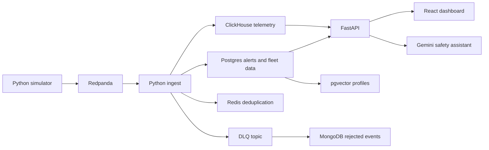

# Driver Safety Intelligence

A local connected-vehicle safety prototype. It generates synthetic vehicle data, streams events through Redpanda, calculates safety scores, raises alerts, and provides a fleet-scoped API, dashboard, and Gemini assistant.

This is an independent hackathon project; it is not affiliated with Motorq.

## Architecture



Postgres stores fleets, drivers, vehicles, users, and alerts. ClickHouse stores telemetry. Redis supports deduplication and API rate limiting. MongoDB stores rejected events. pgvector stores vehicle behavior profiles.

## Requirements

- Docker Compose v2
- Python 3.12 recommended (CI uses 3.12; local validation used Python 3.14)
- Node.js 22 and npm
- A Gemini API key to use the AI assistant

## Configure

Copy `.env.example` to `.env` and fill in local credentials and secrets. Do not commit `.env`.

PowerShell:

```powershell
Copy-Item .env.example .env
```

macOS/Linux:

```bash
cp .env.example .env
```

The environment file provides Postgres, ClickHouse, Kafka, Redis, MongoDB, JWT, Gemini, CORS, and scoring settings. Set `JWT_SECRET` to a private value of at least 32 bytes. `GEMINI_API_KEY` is required for the assistant.

## Local Setup

Create and activate a Python virtual environment, then install the project dependencies.

PowerShell:

```powershell
py -3.12 -m venv .venv
.venv\Scripts\Activate.ps1
python -m pip install -r requirements.txt
```

macOS/Linux:

```bash
python3.12 -m venv .venv
source .venv/bin/activate
python -m pip install -r requirements.txt
```

Start the databases and broker:

```bash
docker compose up -d
docker compose ps
```

On a fresh Postgres volume, Compose automatically runs `db/migrations/001_init.sql`. The API expects `app_user.username`, while that initial migration defines a different `app_user` shape. For a fresh local demo database, replace that table before seeding users. This deletes existing login rows; do this only in a disposable demo database.

PowerShell (default local Postgres user/database):

```powershell
docker compose exec postgres psql -U driver -d driversafety -c "DROP TABLE IF EXISTS app_user"
Get-Content -Raw .\db\auth_schema.sql | docker compose exec -T postgres psql -U driver -d driversafety
Get-Content -Raw .\db\vector_schema.sql | docker compose exec -T postgres psql -U driver -d driversafety
Get-Content -Raw .\db\agent_audit.sql | docker compose exec -T postgres psql -U driver -d driversafety
Get-Content -Raw .\db\clickhouse_init.sql | docker compose exec -T clickhouse clickhouse-client --user ch --password ch --multiquery
```

macOS/Linux (replace `driver`, `driversafety`, and `ch` if your `.env` uses different values):

```bash
docker compose exec postgres psql -U driver -d driversafety -c "DROP TABLE IF EXISTS app_user"
docker compose exec -T postgres psql -U driver -d driversafety < db/auth_schema.sql
docker compose exec -T postgres psql -U driver -d driversafety < db/vector_schema.sql
docker compose exec -T postgres psql -U driver -d driversafety < db/agent_audit.sql
docker compose exec -T clickhouse clickhouse-client --user ch --password ch --multiquery < db/clickhouse_init.sql
```

Seed the database and create demo users/topics:

```bash
python -m db.seed
python -m db.seed_users
python -m services.common.topics
```

`db.seed` creates 100,000 synthetic vehicles across 200 fleets, with seeded driver-risk values. **It truncates fleet data and related records**; run it only when resetting a disposable demo database. Run `db.seed_users` after it because the seed can remove users through cascading truncation.

Demo users are `manager1` and `manager2`, both with password `demo1234`. These credentials are for local demonstration only.

## Run the Application

Run each long-lived process in its own terminal from the repository root:

```bash
python -m services.ingest.main
```

```bash
python -m services.ingest.dlq_sink
```

For a 15-minute local stream that includes vehicles from both demo fleets:

```bash
python -m services.simulator.main --vehicles 20000 --active 1.0 --hz 0.05 --boost 10 --duration 900
```

The simulator generates synthetic events. `--boost 10` intentionally amplifies harsh events for a more visible demo; it is not a calibrated real-world rate. To include all 100,000 seeded vehicles in the simulator input, use `--vehicles 100000`; expect greater local resource use.

After telemetry has accumulated, build vehicle behavior profiles:

```bash
python -m services.vector.build_profiles
```

Run the API in another terminal:

```bash
python -m uvicorn services.api.main:app --host 127.0.0.1 --port 8000
```

Run the dashboard in another terminal:

```bash
cd frontend
npm ci
npm run dev
```

Open <http://127.0.0.1:5173/>. Sign in as either demo manager. Each manager sees only their assigned fleet. Stop workers and servers with Ctrl+C.

The Compose file starts infrastructure only. Database initialization, seeding, workers, API, and frontend are separate steps; a single-command full-app setup has not been implemented.

## Implemented Features

- Synthetic simulator with per-driver risk values and configurable event rate, active fraction, duration, and event boost.
- Redpanda topics for raw telemetry, dead-letter events, and alerts.
- Event validation, Redis deduplication, DLQ persistence to MongoDB, and batched ClickHouse writes.
- Harsh-event burst alerts (default: 4 events within 120 seconds; 300-second cooldown).
- Seven-day weighted safety scores with shrinkage toward the fleet average.
- Fleet-scoped JWT API, rate-limited login/API requests, leaderboard, vehicle details, alerts, and similar-vehicle lookup.
- Gemini assistant with read-only fleet tools and an `agent_audit` record for requests, tool calls, and answers.
- React dashboard for fleet overview, vehicles, alerts, and the assistant.

API documentation is available at <http://127.0.0.1:8000/docs> while the API is running.

## Checks

From the repository root:

```bash
python -m pytest -q --cov-fail-under=80
python -m ruff check .
```

For the frontend:

```bash
cd frontend
npm audit --audit-level=high
npm run build
```

The local validation record is in [`evidence/stage8-local-validation.md`](evidence/stage8-local-validation.md). The load-test procedure is in [`load_tests/README.md`](load_tests/README.md).

## Demo Login

After starting the application, open the dashboard at http://127.0.0.1:5173/.

Use either of the following demo accounts to log in:

| User ID    | Password   |
| ---------- | ---------- |
| `manager1` | `demo1234` |
| `manager2` | `demo1234` |

Each manager is assigned to a separate fleet, so the dashboard only shows the vehicles, scores, alerts, and other data belonging to that manager's fleet.

**Note:** These credentials are for local demonstration only and should not be used in a production environment.


## Scope and Limitations

This repository currently documents and runs a local prototype. AWS deployment, 100K events/second performance, 3× burst and soak results, latency targets, and broker-failure recovery have not been demonstrated. The local Redpanda Compose setup is single-node.

TLS, cloud secret management, encryption-at-rest evidence, a general audit trail for every data access, and retention/erasure workflows are not implemented. Do not represent these as completed requirements. Synthetic seed records are not real vehicle data.
